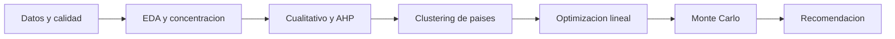

# Explicación general: Optimización del portafolio de importaciones de Bogotá

Documento de lectura sobre el cuadernillo `Proyecto Importaciones Bogota.ipynb`. Resume para qué se hizo el trabajo, qué conceptos técnicos usa y qué concluye. No describe código ni implementación.

**Trabajo original:** Johan Nicolás Valderrama Serrato, Mariana Prada Riaño, Paola Andrea Castro  
**Asignatura:** Toma de Decisiones Organizacionales  
**Dominio:** logística y cadena de suministro  
**Fuente:** Portal de Datos Abiertos de Bogotá — dataset de importaciones

---

## 1. Para qué se hizo

El cuadernillo responde una pregunta de decisión, no un ejercicio de visualización:

> Dada la canasta real de socios estratégicos de Bogotá, ¿cómo redistribuir las importaciones para bajar concentración y riesgo geopolítico sin encarecer de forma relevante el costo logístico, respetando los TLC y el hecho de que cambiar de proveedor tiene costo?

Eso importa porque el problema **no** es “abrir comercio con más países”. En los datos aparecen cerca de **189 orígenes**, pero eso es diversidad nominal. El riesgo de desabastecimiento vive en un puñado de socios de alto volumen, sobre todo **China y Estados Unidos**, que juntos concentran alrededor del **51%** del valor CIF.

El trabajo, por tanto, hace tres cosas:

1. Diagnosticar cómo está concentrado el portafolio y qué tan costoso es traer mercancía desde cada origen.
2. Traducir criterios de política (diversificar, costo, confiabilidad, tecnología, riesgo) en pesos y restricciones.
3. Proponer una asignación óptima **dentro del cluster que realmente mueve el comercio**, y luego probar si esa asignación resiste shocks aleatorios.

Es un modelo de apoyo a la decisión organizacional: no reemplaza contratos, aduanas ni política comercial, pero cuantifica trade-offs que de otro modo quedarían en juicio cualitativo.

---

## 2. Cómo está armado el razonamiento

El cuadernillo encadena cinco capas. Cada una alimenta a la siguiente.

- **Datos:** definen el universo observable (ene–jul 2025) y el costo logístico medido.
- **EDA:** muestra concentración, composición por uso/tecnología y heterogeneidad de fletes.
- **AHP:** prioriza criterios y calibra, de forma didáctica, scores de riesgo.
- **K-Means:** recorta el problema a los países que sí importan volumen.
- **Programación lineal:** busca la redistribución óptima bajo reglas de política.
- **Monte Carlo:** pregunta si esa solución sigue siendo buena cuando costos, tipo de cambio y suministro dejan de ser deterministas.

---

## 3. Datos, calidad y conceptos de comercio

### 3.1 Universo

Los registros se extraen del API de Datos Abiertos de Bogotá. Tras limpieza quedan **238.305 filas** y **17 variables** de negocio (periodo, mes, país, partida arancelaria, CIIU, capítulo, nivel tecnológico, uso económico, valores CIF/FOB, kilos y cantidad).

Cobertura temporal: **enero a julio de 2025**. No hay un año completo, así que no se puede afirmar estacionalidad con rigor.

Magnitudes observadas:

| Métrica | Valor |
|---|---|
| Valor CIF total | USD 40.0 mil millones |
| Valor FOB total | USD 37.8 mil millones |
| Ratio CIF/FOB | 1.059 |
| Peso neto | 26.2 mil millones de kg |
| Orígenes únicos (tras limpieza) | 189 |

### 3.2 CIF, FOB y costo logístico

- **FOB** (Free On Board): valor de la mercancía puesta a bordo, sin el tramo internacional de flete y seguro.
- **CIF** (Cost, Insurance and Freight): FOB más flete y seguro hasta el destino.

El **ratio CIF/FOB** es el proxy de costo logístico unitario del trabajo. Un ratio de **1.059** significa que flete y seguro añaden, en promedio, **cerca de 5.9%** sobre el valor de la mercancía. Ese número no es uniforme: Canadá, Trinidad y Tobago, Japón o Brasil pagan recargos relativos más altos; Alemania, México o Ecuador, más bajos.

Ese ratio se convierte después en el parámetro de costo \(c_i\) del modelo de optimización: no se inventa un costo de transporte, se observa en los datos.

### 3.3 Decisiones de calidad que sí cambian el modelo

- **Duplicados exactos:** 10 filas (0.004%), eliminadas.
- **Nulos y negativos:** no hay.
- **FOB > CIF:** 0 casos. El dataset es internamente coherente en esa identidad contable.
- **CIF positivo con peso 0:** 7 registros, interpretados como posibles intangibles; no distorsionan el agregado.
- **Clave primaria:** periodo + mes + país + partida + CIIU + capítulo **no** identifica filas únicas (cientos de miles de colisiones). La granularidad real es más fina que esa combinación: hay múltiples embarques o declaraciones para la misma canasta. El análisis agrega por país y no pretende modelar cada declaración.

### 3.4 Zonas francas

En el crudo, varias **zonas francas colombianas** aparecen como si fueran país de origen. El trabajo las consolida en `Colombia (Zona Franca)`: **22 entidades**, **1.099 registros**, **USD 585 millones (1.46% del CIF)**. El conteo de orígenes pasa de 210 a 189.

Más adelante se las **excluye del modelo de redistribución internacional**. La razón no es cosmética: el ratio CIF/FOB de zona franca es ~1.005 porque es territorio aduanero nacional. Dejarlas dentro haría que el optimizador “diversifique” hacia Colombia y mejore métricas de riesgo **sin reducir exposición externa**.

---

## 4. Qué muestra el análisis descriptivo

### 4.1 Concentración: HHI, Gini y Pareto

El **índice Herfindahl-Hirschman (HHI)** suma los cuadrados de las participaciones y las escala a 0–10.000. En antimonopolio suele leerse así:

- &lt; 1.000: poco concentrado
- 1.000–1.800: concentración moderada
- &gt; 1.800: alta concentración

Sobre el portafolio completo, **HHI = 1.397**: mercado **moderadamente concentrado**. Eso no contradice que dos países pesen la mitad: el resto de la cola diluye el índice, pero el riesgo sistémico sigue estando en la cabeza.

Otras lecturas de desigualdad:

- **Coeficiente de Gini = 0.916** (curva de Lorenz). Cercano a 1: desigualdad extrema de participaciones entre países.
- **Pareto operativo:** hacen falta **14 países** para cubrir el 80% del CIF.
- **Top 5:** 63.9% del CIF. **Top 10:** 74.3%.

Participación aproximada de los principales orígenes:

| País | Participación CIF |
|---|---|
| China | 26.5% |
| Estados Unidos | 24.3% |
| Brasil | 5.0% |
| México | 4.9% |
| Alemania | 3.3% |
| India | 2.6% |
| Japón | 2.4% |
| Corea del Sur | 1.9% |
| España | 1.8% |
| Vietnam | 1.7% |

El análisis cualitativo resume esto con una idea útil: la diversidad nominal de 189 países equivale, en la práctica, a unos **7 proveedores homogéneos** (número efectivo). Contar países no es medir resiliencia.

### 4.2 Composición de la canasta

Por **uso económico**:

- Materias primas: **48.5%**
- Bienes de consumo: **25.9%**
- Bienes de capital: **25.6%**

Por **nivel tecnológico**, el bloque más grande es **manufacturas de tecnología media** (~USD 13.0 mil millones), seguido de manufacturas basadas en recursos naturales, alta tecnología, baja tecnología y bienes primarios.

Eso tiene implicación de riesgo: casi la mitad de lo importado son insumos. Una disrupción no solo encarece el flete; puede detener producción local. Fuentes externas citadas en el cuadernillo (DANE, ANDI) se usan para argumentar que los inventarios industriales no dan mucho colchón.

### 4.3 Heterogeneidad logística

El mapa de costos (volumen CIF vs ratio CIF/FOB, con precio por kilo) muestra que **diversificar no es gratis ni simétrico**. Hay corredores baratos en flete relativo y corredores caros; hay orígenes de alto volumen y bajo valor unitario, y nichos de alto valor por kilo (el clustering lo retomará).

---

## 5. Análisis cualitativo y AHP

### 5.1 Observación estructurada

Antes de los pesos matemáticos hay un puente cualitativo: cada hallazgo del EDA se cruza con evidencia externa (Procolombia, DANE, Ministerio de Comercio, ANDI, OCDE, Logistics Performance Index del Banco Mundial). Cinco tesis alimentan el modelo:

1. La concentración China–EE.UU. es **estructural**, no un accidente de siete meses.
2. Las materias primas **amplifican** el costo de un faltante más allá del flete.
3. Los costos logísticos **difieren por corredor**: hay trade-off real al mover volumen.
4. Los **TLC están subutilizados** (el cuadernillo cita utilización ~68% del potencial según OCDE 2023).
5. La cola de países pequeños no es un plan B operativo.

De ahí salen, de forma explícita, la restricción de presupuesto de riesgo, los scores \(r_i\), el mínimo de compras con TLC y la penalidad por faltante de la simulación.

### 5.2 Proceso Analítico Jerárquico (AHP)

El **AHP** (Saaty) convierte comparaciones pareadas —“¿qué tan más importante es A que B?”— en un vector de pesos. La escala va de 1 (igual importancia) a 9 (extremadamente más importante). El recíproco cierra la matriz.

Criterios evaluados:

1. **Costo CIF** — competitividad de precio y recargo logístico.
2. **Diversificación** — no depender de pocos proveedores.
3. **Confiabilidad logística** — estabilidad de tiempos y costos de envío.
4. **Nivel tecnológico** — valor agregado de lo importado.
5. **Riesgo geopolítico** — estabilidad del país de origen.

La jerarquía que el equipo impuso, apoyada en literatura de supply chain (Chopra y Sodhi, 2014; Christopher y Peck, 2004; Manuj y Mentzer, 2008), privilegia **resiliencia estructural** sobre precio, y precio sobre sofisticación tecnológica.

**Pesos resultantes:**

| Criterio | Peso |
|---|---|
| Diversificación | 40.3% |
| Costo CIF | 24.4% |
| Confiabilidad logística | 13.7% |
| Riesgo geopolítico | 13.7% |
| Nivel tecnológico | 7.9% |

**Ratio de consistencia (CR) = 0.0074.** En AHP, CR &lt; 0.10 se considera matriz coherente: los juicios no se contradicen de forma grave. CR no prueba que los juicios sean “verdaderos”, solo que son internamente consistentes.

Limitación declarada por los autores: los juicios **no pasaron por un panel de expertos** en comercio exterior colombiano. Son didácticos.

### 5.3 Ranking híbrido (AHP + datos)

Los pesos se aplican a proxies observados (inverso del ratio CIF/FOB, frecuencia de operaciones, volumen físico) para un score de países. China y EE.UU. siguen arriba porque el volumen y la frecuencia pesan mucho; Alemania, México, Italia o Suiza suben por mejor balance costo–presencia. Ese ranking es un puente descriptivo; **la decisión formal la toma el modelo lineal**, no el score.

---

## 6. Clustering de países proveedores

### 6.1 Idea

No tiene sentido optimizar sobre 189 orígenes. Muchos son ruido. El clustering agrupa países **parecidos en perfil logístico y de volumen** para aislar el conjunto donde una redistribución sí mueve el CIF de Bogotá.

### 6.2 Diseño técnico

- Universo: **67 países** con participación &gt; 0.05% del CIF.
- Variables (después de logaritmo donde hace falta, y **estandarización**):
  - ratio CIF/FOB
  - log(precio por kg) — comprime outliers de alto valor unitario
  - log(CIF total) — distingue “gigantes” de “hormigas”
  - log(número de transacciones)
- Algoritmo: **K-Means**.
- Elección de \(k\): se comparan inercia (codo) y **coeficiente de silueta**. El máximo de silueta en el rango 2–5 es **k = 4** (silueta 0.355). El valor es moderado: los grupos son interpretables, no nítidos al estilo de un laboratorio. Se prioriza interpretabilidad gerencial sobre un \(k\) más fino.
- **PCA** (dos componentes) no define los clusters; solo proyecta el espacio 4D para verlos.

### 6.3 Los cuatro perfiles

| Cluster | Lectura | Países | % CIF | Ratio medio | Precio/kg medio | Ejemplos |
|---|---|---|---|---|---|---|
| 0 | Socios estratégicos, alto volumen | 24 | 89.6% | 1.056 | USD 3.10 | China, EE.UU., Brasil, México, Alemania |
| 1 | Proveedores eficientes de nicho | 25 | 5.8% | 1.042 | USD 16.52 | Suiza, Reino Unido, Irlanda, Suecia, Polonia |
| 2 | Emergentes / medio volumen | 17 | 4.0% | 1.075 | USD 1.73 | Trinidad y Tobago, Rusia, Bolivia, Finlandia |
| 3 | Ocasional / alto costo relativo | 1 | 0.1% | 1.388 | USD 0.07 | Argelia |

La decisión estratégica se concentra en el **Cluster 0**. El Cluster 1 importa como **segunda línea**: flete relativo bajo y alto valor unitario, pero poco volumen hoy. El Monte Carlo demostrará que quedarse solo dentro del Cluster 0 no alcanza si China y EE.UU. fallan a la vez.

---

## 7. Optimización: redistribuir el cluster estratégico

### 7.1 El problema, en lenguaje de decisión

El Cluster 0 incluye 24 países. Se excluye Colombia (Zona Franca). Quedan **23 proveedores internacionales** y una demanda de cluster de **USD 35.244 millones**.

La pregunta deja de ser “¿con quién más comerciar?” y pasa a ser: **¿qué fracción \(x_i\) del cluster debe tener cada socio, respetando reglas de política?**

### 7.2 Tipo de modelo

Es un **programa lineal (LP)**: función objetivo lineal, restricciones lineales, variables continuas. Se resuelve hasta optimalidad (status *Optimal*). La linealidad es una elección: es tractable y dualizable, pero puede empujar soluciones de esquina (todo el movimiento hacia el país más barato que aún cabe en las cotas).

### 7.3 Piezas del modelo

**Conjuntos**

- \(I\): 23 países del cluster estratégico.
- \(T \subset I\): socios con TLC vigente con Colombia (13 en la corrida: Alemania, Bélgica, Brasil, Canadá, Corea del Sur, Chile, España, Estados Unidos, Francia, Italia, México, Países Bajos, Perú).

**Parámetros**

- \(c_i\): ratio CIF/FOB observado (costo logístico unitario).
- \(r_i\): score de riesgo geopolítico 0–10, calibrado de forma didáctica con Global Risk Index (WEF), Economic Complexity Index (Harvard) y tensiones comerciales documentadas. Ejemplos: China 8.5, India 6.0, EE.UU. 5.0, Alemania 3.0, Suiza 2.5.
- \(a_i\): participación actual del país en el cluster.
- \(\tau = 0.048\): costo de transición por unidad de cambio de portafolio (renegociar, certificar, rearmar logística).
- Cotas por país: mínimo **0.5%**, máximo **25%** (política anti-concentración alineada con el AHP).
- Mínimo desde TLC: **40%**.
- Presupuesto de riesgo \(R_{\max}\): techo sobre el riesgo ponderado \(\sum r_i x_i\).

**Variables**

- \(x_i\): nueva participación del país \(i\).
- \(\delta_i^+\), \(\delta_i^-\): aumento o reducción respecto a \(a_i\).

**Objetivo**

Minimizar costo logístico del portafolio más la penalización por moverse lejos del status quo:

\[
\min Z = \sum_{i \in I} c_i x_i + \tau \sum_{i \in I} (\delta_i^+ + \delta_i^-)
\]

Sin \(\tau\), el modelo saltaría de golpe al mix más barato factible. Con \(\tau\), reconoce inercia organizacional.

**Restricciones**

1. Las participaciones suman 1 (se asigna todo el cluster).
2. Identidad de transición: \(x_i - a_i = \delta_i^+ - \delta_i^-\).
3. Riesgo ponderado \(\le R_{\max}\).
4. Suma de socios con TLC \(\ge 40\%\).
5. \(0.5\% \le x_i \le 25\%\).
6. No negatividad.

### 7.4 Escenarios de política de riesgo

No hay un único “óptimo social”. Hay tres posturas sobre cuánto riesgo se tolera, medidas contra el riesgo actual del cluster (\(R_{\text{actual}} = 5.684\)):

| Escenario | \(R_{\max}\) | Costo logístico | Transición | Riesgo | HHI | Máx. país |
|---|---|---|---|---|---|---|
| Base (actual) | 5.684 | 1.0604 | — | 5.684 | 1.790 | 30.1% |
| Permisivo | 5.684 | 1.0580 | 0.0073 | 5.506 | 1.455 | 25.0% |
| **Moderado** | **4.831** (−15%) | **1.0548** | **0.0164** | **4.831** | **1.335** | **25.0%** |
| Estricto | 3.979 (−30%) | 1.0494 | 0.0317 | 3.979 | 1.534 | 25.0% |

Lectura:

- Incluso el escenario permisivo ya baja HHI porque el tope de 25% recorta a China y EE.UU.
- El **Moderado** logra a la vez menos concentración (HHI 1.335) y menos riesgo, con costo logístico **inferior** al actual (−0.53%). El costo total de la función objetivo sí sube **+1.02%** (1.0604 → 1.0712) por la penalización de transición: diversificar no es gratis, pero el flete observado no empeora.
- El Estricto sigue bajando riesgo y costo logístico, pero el **HHI vuelve a subir** (1.534): para cumplir un techo de riesgo muy duro, el modelo concentra volumen en pocos socios “baratos y seguros”. Menos riesgo geopolítico no es automáticamente más diversificación.

Por eso el Moderado se declara **Pareto-dominante en el rango analizado**: mejor equilibrio concentración–riesgo–costo que los otros dos.

### 7.5 Qué mueve el escenario Moderado

Movimientos materiales (participación **dentro del cluster**, no del CIF global):

- **China:** 30.1% → 15.5% (−14.6 puntos).
- **Estados Unidos:** 27.5% → 25.0% (toca el techo).
- **Francia:** 1.5% → 18.6% (+17.1 puntos). Es el gran receptor: TLC, riesgo bajo (3.0) y ratio CIF/FOB atractivo (1.033).
- El resto del cluster permanece casi en su participación actual: el costo de transición y las cotas hacen que no convenga remezclar a todos.

Ese salto grande hacia Francia es coherente con un LP: una vez que hay que sacar volumen de China, el modelo lo estaciona en el destino factible de mejor coeficiente. Los autores advierten que la linealidad puede producir **asignaciones de esquina**. El análisis dual mitiga en parte la preocupación: 21 de 23 países quedan en región interior.

### 7.6 Sensibilidad y dualidad

En un LP, el **precio sombra** de una restricción dice cuánto mejoraría (o empeoraría) el óptimo si se relajara esa regla en una unidad, cerca de la solución actual.

Hallazgos:

- 25 de 26 restricciones están **activas**.
- \(R_{\max}\) es la restricción dominante: precio sombra \(\pi_{R3} \approx -0.0112\). Relajar el presupuesto de riesgo en 0.1 reduce \(Z^*\) en ≈ 0.0011.
- Hay un **punto de inflexión cerca de \(R_{\max} \approx 3.69\)**: por debajo, el costo marginal de “comprar” menos riesgo crece rápido. Recomendación operativa: no apretar el techo de riesgo por debajo de ese umbral sin una razón estratégica explícita.

---

## 8. Monte Carlo: el óptimo bajo incertidumbre

### 8.1 Por qué simular

El LP trata \(c_i\) y la capacidad de cada país como **datos fijos**. En la realidad hay tipo de cambio, shocks de flete y cortes de suministro. La simulación toma la asignación óptima del escenario Moderado como **parámetro fijo** y la somete a **10.000** realizaciones aleatorias, comparándola con el portafolio actual bajo los **mismos** shocks.

### 8.2 Mecánica conceptual

En cada iteración, el costo combina:

1. Importación efectiva: costo logístico × asignación × demanda × factor de suministro × tipo de cambio × shock de flete.
2. **Penalidad por faltante** \(\phi = 1.5\): lo no cubierto se supone comprado de emergencia en spot, 50% más caro. Eso traduce la tesis cualitativa de que un faltante de insumos cuesta más que el flete.

Indicadores:

- **VaR 95%:** umbral de costo que solo se supera el 5% de las veces (peor cola).
- **CVaR 95%:** promedio de esa cola mala (más severo que el VaR).
- Cobertura media de demanda.
- **P(cobertura &lt; 90%):** probabilidad de falla crítica.

Fuentes de aleatoriedad (supuestos razonables, no calibrados con series de interrupciones reales):

| Variable | Forma | Idea |
|---|---|---|
| Tipo de cambio | Normal(1, 0.05) | volatilidad ~5% USD/COP |
| Disrupción, países de alto riesgo (\(r_i \ge 7\)) | Bernoulli(0.12) | China y similares |
| Disrupción, socios con TLC | Bernoulli(0.03) | acuerdos bajan la base de riesgo |
| Disrupción, resto | Bernoulli(0.05) | |
| Magnitud si hay corte | Uniforme(0.20, 0.80) | se pierde entre 20% y 80% del suministro |
| Shock logístico | Log-normal(0, 0.08) | flete y seguro ruidosos |

En el escenario **Normal** las disrupciones se asumen **independientes** entre países. En los de estrés se **fuerza** \(S_{\text{China}} = 0.5\) (y también \(S_{\text{EE.UU.}} = 0.5\) en el dual) en todas las iteraciones: es una prueba de estrés, no un muestreo de la distribución histórica.

### 8.3 Resultados

Comparación simétrica base vs. óptimo:

| Condición | KPI | Base | Óptimo | Lectura |
|---|---|---|---|---|
| Normal | VaR 95% (USD M) | 42.050 | 41.539 | cola de costo más baja |
| Normal | Cobertura media | 97.0% | 97.7% | |
| Normal | P(cob &lt; 90%) | 11.6% | 7.6% | menos fallas críticas |
| Estrés China −50% | VaR 95% | 43.705 | 42.404 | |
| Estrés China −50% | Cobertura media | 83.7% | 90.8% | el óptimo absorbe mejor el corte |
| Estrés China −50% | P(cob &lt; 90%) | 100% | 15.0% | el base falla siempre; el óptimo no |
| Estrés dual | VaR 95% | 45.717 | 44.180 | sigue siendo mejor, pero... |
| Estrés dual | Cobertura media | 70.3% | 78.7% | |
| Estrés dual | P(cob &lt; 90%) | 100% | 100% | **nadie cubre el 90%** |

Conclusión de resiliencia: el portafolio Moderado **domina al actual en todos los entornos**. La ventaja se **amplifica** cuando China se cae a la mitad, precisamente porque el óptimo ya había recortado esa exposición.

Límite estructural: **ninguna redistribución dentro del Cluster 0** aguanta un corte simultáneo de los dos proveedores dominantes. Diversificar *adentro* del club de los grandes no crea un plan B suficiente. De ahí la recomendación de desarrollar el Cluster 1 (nicho eficiente) como segunda línea.

---

## 9. Conclusiones

1. **Concentración moderada, riesgo de cabeza alto.** HHI global 1.397 con China + EE.UU. al ~51% del CIF. El índice no “absuelve” la dependencia de dos orígenes.
2. **El criterio que más pesa es diversificar**, no el precio. AHP consistente (CR = 0.0074): diversificación 40.3%, costo 24.4%.
3. **El problema real cabe en 23 países.** El Cluster 0 mueve el 89.6% del CIF; el resto es periferia.
4. **Se puede bajar riesgo y concentración sin pagar más flete observado.** En Moderado: HHI del cluster 1.790 → 1.335 (−25.4%); riesgo ponderado −15%; ratio logístico 1.0604 → 1.0548. Lo que sí se paga es transición (+1.02% en la función objetivo).
5. **El techo de riesgo es la palanca más valiosa** del LP, hasta el umbral ~3.69, donde endurecer la política se vuelve caro.
6. **Moderado es la postura recomendada** entre permisivo, moderado y estricto.
7. **El óptimo es más resiliente, no invulnerable.** Ante shock dual China + EE.UU., la probabilidad de falla crítica sigue en 100% para ambos portafolios.

### Recomendación

Adoptar el escenario **Moderado** (\(R_{\max} = 0.85 \times R_{\text{actual}}\)) como guía de redistribución, y acompañarlo con:

- Desarrollo activo del **Cluster 1** como segunda fuente, porque el Monte Carlo muestra que rebanar el Cluster 0 no basta ante un corte dual.
- **Monitoreo trimestral** de HHI, riesgo ponderado y cobertura simulada.
- **Contratos marco** con alternativos para bajar el \(\tau\) efectivo (hacer más barato el cambio cuando aparezca la señal de disrupción).
- No empujar \(R_{\max}\) por debajo de **~3.69** sin justificación estratégica puntual.

### Limitaciones (del propio trabajo)

- Solo **siete meses** de 2025.
- Juicios AHP y scores \(r_i\) **didácticos**, no validados por un panel ni por historial de interrupciones.
- Parámetros Monte Carlo (probabilidades, magnitudes, volatilidades) son **supuestos plausibles**, no calibración econométrica.
- El LP puede **cargar de más** a un destino de buen coeficiente (el caso Francia); es el precio de la linealidad.

---

## 10. Glosario de conceptos

- **CIF / FOB:** dos valoraciones de la misma mercancía; su cociente aproxima el recargo de flete y seguro.
- **HHI:** índice de concentración; sube cuando pocas participaciones dominan.
- **Gini / Lorenz:** desigualdad de la distribución de valor entre países.
- **Número efectivo de proveedores:** traducción de la concentración a “cuántos socios equivalentes” hay, frente al conteo crudo de países.
- **AHP:** método de decisión multicriterio por comparaciones pareadas.
- **Escala de Saaty:** 1 a 9 para expresar intensidad de preferencia.
- **CR (consistency ratio):** diagnóstico de coherencia de la matriz AHP; umbral habitual 0.10.
- **K-Means:** partición de observaciones en \(k\) grupos por proximidad a centroides, en espacio de variables numéricas.
- **Silueta:** qué tan compacto y separado quedó cada punto respecto a su grupo; ayuda a elegir \(k\).
- **Estandarización:** pone las variables en escala comparable para que el volumen en dólares no aplaste al ratio CIF/FOB.
- **PCA:** proyección a pocas dimensiones para visualizar; aquí no es el modelo de agrupación.
- **Programación lineal:** optimizar una función lineal sujeta a desigualdades lineales.
- **Costo de transición \(\tau\):** freno explícito a reconfiguraciones bruscas del portafolio.
- **Presupuesto de riesgo \(R_{\max}\):** techo sobre el riesgo promedio ponderado por participación.
- **Precio sombra:** valor marginal de relajar una restricción en el óptimo.
- **Solución de esquina:** el LP satura cotas o mueve mucho volumen a una variable; típico de objetivos lineales.
- **Pareto (en escenarios de política):** un escenario no empeora las métricas relevantes respecto a los otros en el rango comparado.
- **Monte Carlo:** repetir el sistema con números aleatorios para estimar una distribución de resultados.
- **VaR 95%:** umbral de la cola mala al 5%.
- **CVaR 95%:** promedio de esa cola; captura severidad, no solo el umbral.
- **Prueba de estrés:** imponer a mano un shock grande (China −50%, o China y EE.UU. a la vez) en lugar de dejarlo a la suerte del muestreo.

---

*Este texto describe el cuadernillo ejecutado (resultados de la corrida en Colab). Cifras puntuales de VaR pueden variar levemente entre la narrativa final y tablas intermedias por redondeo o por el conjunto exacto de iteraciones reportado en cada celda; la dirección de todos los hallazgos es la misma.*
